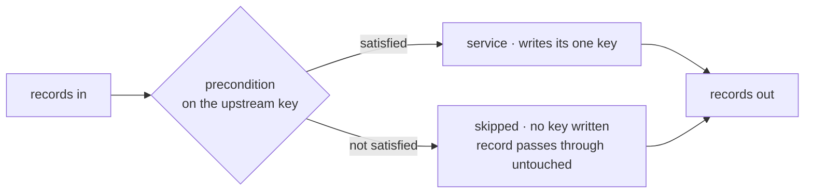

# Raw Corpus to Release — the workflow

**Companion to:** [`spec.md`](spec.md) · **Grounded in:** [`objective.md`](objective.md)

Fifteen services, four phases, one record that every one of them reads and returns. This
document is the run end to end, and — at the bottom — the order the pieces get built.

Two ways to drive it, one implementation: **over HTTP** (one route per service, one per phase) and
**in-process** (chain the same functions). A shell is never a second copy.

---

## The run

```mermaid
flowchart LR
  RAW[("source items")] --> S0

  subgraph P0["load_data · stage 0"]
    S0["load_data"]
  end

  subgraph P1["data_quality · stages 1-3"]
    direction LR
    S1["label_check"] --> S2["pii_check"] --> S3["duplicate_check"]
  end

  subgraph P2["ai_review · stages 4-6"]
    direction LR
    S4["jury"] --> S5["cohesion"] --> S6["triage"]
  end

  subgraph P3["human_review · stages 7-11"]
    direction LR
    S7["question_generate"] --> S8["publish"]
    S9["annotator_answers"] --> S10["aggregate"] --> S11["curate"]
  end

  subgraph P4["release · stages 12-14 · declared, not built"]
    direction LR
    S12["split"] --> S13["export"] --> S14["datasheet"]
  end

  S0 --> S1
  S3 --> S4
  S6 --> S7
  S8 -->|"questions"| STORE[("question store")]
  STORE -->|"sync"| LS["Label Studio"]
  LS -->|"annotations"| STORE
  STORE -->|"responses"| S9
  S11 --> S12
```

Records move left to right, and **every record that goes in comes out** — a record that fails a check is
marked and travels on, never dropped. The only place work leaves the pipeline is between `publish` and
`annotator_answers`, where
questions go to a store we own, out to Label Studio, and answers come back the same way. `release` is
declared so the flow is complete and the record's `release` key has an owner; it is not in this build.

---

## One record, one key per service

Every service has the same signature — records in, records out — and adds **exactly one key**, changing
nothing else. That single rule buys three things: any service can be re-run on its own, two services can
never fight over one field, and a record carries its own history rather than needing a side table.

A service copies the record with its one key set. It does not mutate, and it does not build a record
from scratch — only `load_data` does that.

**The one exception is `pii_check`**, which also rewrites `content` and bumps `content_version`. That is
why its spans record which version they were found in: after the rewrite, the offsets no longer point
where they did.

---

## Nothing is removed, and nothing halts

There are no gates. An earlier draft had them — every stage returning verdicts, a failing one halting
the run — and they are deleted, because the record already carries every verdict a gate was checking.
Two computations of one number can disagree, and then neither is the dataset's state.

What replaces a gate is a **precondition**: a service reads the upstream key off the record and skips.

Two consequences worth being explicit about.

**Conservation is structural, not asserted.** No stage removes a record: quarantine is a flag,
deduplication is a group annotation on the record, and a rejected record travels the whole flow carrying
why. `output == input` at every stage because there is no code path that drops one — so there is nothing
left to check.

**Corpus-level numbers are a report, not a verdict.** Counts are folded over the records at the edge and
written to `metrics.json` for a human to read in a diff. A declared count that has moved is a line in
that diff. **It does not stop anything** — that is the real cost of removing gates, and it is stated
again under *What a bad record does now*.

---

## Stage by stage

**Skips when** is the precondition each service reads off the record. A record that does not satisfy it
is passed through untouched, with no key written for that service.

### `load_data` — stage 0 · `POST /load-data`

Turns each source item into a record: identity, content, provenance. Text arrives inline in the request
body — for `text2text` that is the whole job. A media modality resolves each item's URI at the edge and
records `uri` + `sha256`, never bytes.

| # | stage | reads | writes | skips when |
|---|---|---|---|---|
| 0 | `load_data` | the raw item, under the declared label key | the whole record | never — it is the first stage. A source digest that does not match raises `ConfigError` before any record is read |

The catalog is never copied onto the record as an answer space. It is materialised from the record when
a service asks, and never persisted — a stored copy is a second thing that can disagree with the first,
and it is the copy that goes stale.

### `data_quality` — stages 1–3 · `POST /data-quality`

Everything checkable without an opinion.

| # | stage | reads | writes | skips when |
|---|---|---|---|---|
| 1 | `label_check` | content, label, meta | `data_quality.label_check` | never; a record that fails a check is marked `quarantined` and travels on |
| 2 | `pii_check` | content | `data_quality.pii_check`, **and rewrites content** | never; a hit layer two cannot confirm raises `unverified`, which `export`'s precondition reads |
| 3 | `duplicate_check` | content, label | `data_quality.duplicate_check` | never; duplicates are grouped on the record, never removed |

**Redaction runs in two layers with opposite jobs.** Patterns go first and are *allowed* to be noisy —
they run against the raw text and against a tone-stripped copy, so a customer saying `khong chin` is
caught while the patterns stay written in correct Vietnamese. A model pass over a bounded window then
sets precision. Values are replaced with typed placeholders scoped per record, never deleted: deleting a
value turns a correct call into what looks like a correct *"required value was missing"*, inverting the
label on exactly the records this project exists to get right.

### `ai_review` — stages 4–6 · `POST /ai-review`

The first opinion about the corpus.

| # | stage | reads | writes | skips when |
|---|---|---|---|---|
| 4 | `jury` | content, label, the materialised answer schema | `ai_review.jury` | `label_check.quarantined` — no point paying a panel to judge a record already known broken |
| 5 | `cohesion` | `ai_review.jury`, label | `ai_review.cohesion` | `ai_review.jury` is absent |
| 6 | `triage` | `ai_review.cohesion`, `data_quality` | `ai_review.triage` | `ai_review.cohesion` is absent |

**Three stages, not one, because they fail for different reasons.** The jury costs money per record and
is cached. Cohesion is arithmetic over what the jury already wrote — two numbers, how much the panel
agrees with itself and how much it agrees with the existing label. Triage reads thresholds that are
provisional until the pilot measures them and get exactly one re-tuning pass. Folded together, moving a
bucket boundary would re-run the panel.

### `human_review` — stages 7–11 · `POST /human-review`

Where the project learns whether the questions are answerable.

| # | stage | reads | writes | skips when |
|---|---|---|---|---|
| 7 | `question_generate` | content, label, `triage` *(selection only)* | `human_review.question_generate` | `triage.selected_for_review` is false |
| 8 | `publish` | the questions, the display half, the capture half | `human_review.publish` | there is no question to publish |
| 9 | `annotator_answers` | the store | `human_review.annotator_answers` | nothing in the store names this record's questions |
| 10 | `aggregate` | the responses | `human_review.aggregate` | fewer responses than the rung's overlap floor; the record keeps its answers and gets no verdict |
| 11 | `curate` | the verdict, label | `human_review.curate` | there is no verdict, or an `incorrect` verdict has no corrected value — recorded as `status: "unresolved"` |

**The phase endpoint stops after `publish`, on purpose.** Stages 9–11 cannot run until people have
answered. An endpoint that ran all five would either block or quietly produce empty verdicts.

---

## The loop through people

`publish` writes questions to a database we own. A separate sync pushes them into Label Studio and pulls
annotations back — so every endpoint works with no Label Studio running anywhere, and
`annotator_answers` reads one shape whatever the annotation tool turns out to be. The cost is task state
in two places, which is why the sync is idempotent in both directions and the two unique constraints
exist to make it so.

An annotator sees one generated question about one record, with the evidence and the glossary, and
answers correct / incorrect / unsure. Answering *incorrect* requires the corrected value.

**No model output may reach an annotator.** The question payload and the generated config carry no vote,
no cohesion number, no bucket — `question_generate` reads triage only to decide *which* records get a
question. That is also why a third surface exists: auditing one decision has to be possible somewhere,
and it cannot be in the annotation UI.

---

## What a bad record does now

**A run always completes.** Nothing halts a batch of 20,000 because 3 records are bad.

- **A record that fails a check** is marked on its own key and travels on. `label_check.quarantined`,
  `pii_check.unverified`, `jury.invalid_votes` — the record says what is wrong with it.
- **A record that fails a precondition** is skipped by that service, gets no key from it, and is counted
  in `metrics.skipped`. Every later service reads the same absence and skips it too, so a record drops
  out of the useful set without ever dropping out of the file.
- **The only thing that refuses to start** is a run whose *configuration* is wrong: an unknown profile,
  a missing declaration, a source digest that does not match, no cross-border review on file, no
  glossary. Those raise `ConfigError` at composition, before a record is read.
- **A declared count that has moved** is a line in a `metrics.json` diff and nothing else.

**The cost, stated plainly.** With redaction off — the default — `pii_check` reports honestly and the
run finishes. What keeps that corpus out of a release is `export`'s precondition
(`pii_check.decision == "redacted"`), and **export is not built yet**. Until it is, nothing in the flow
prevents a reported-but-unredacted corpus reaching an artifact. That is the trade this design makes, and
it is the first thing `release` has to fix.

---

## Three rungs

You do not climb without passing. Promotion between rungs is a human decision, and the
only thing in this project that stops anything.

| rung | who | jury | what it proves |
|---|---|---|---|
| **Smoke** | 1 annotator | stubbed, then live | The plumbing, in one sitting. The run completes and every record comes out the other end. |
| **Pilot** | 2 at 100% overlap | real | The **instruments**. Is the question answerable, is the guideline right, do two people agree, does each bucket predict what humans actually find? |
| **Scale** | several, mixed overlap | staged, expanding on conflict | The release. A designed subset gets human attention — the full test split, the audit sample, the flagged strata — and the remainder ships `unvalidated` **with a measured error bar**. |

Two prerequisites are not code and block the rungs anyway: a cross-border data-transfer review before the
first jury call to any offshore endpoint, and a written glossary before the first question is generated.
Without the glossary, two annotators reading a marker differently means the agreement statistic measures
the glossary's ambiguity rather than the records' difficulty — and no threshold change fixes that.

---

## The order this gets built

Nothing exists yet — `src/` and `tests/` are both deleted, deliberately, so the rebuild has one answer to
every question.

1. **The guards, before any service.** No filesystem in the engine, no concrete axis under `pipeline/`,
   no re-implementation of the toolkit, no identity in a class body, a description on every field, and
   no stage that removes a record. Each is proved against synthetic source, so it fails before it is
   ever needed. Written after the services, a guard only ratifies whatever was already done.
2. **The shared vocabulary.** `errors.py`, `record.py`, `manifest.py` — three modules every layer uses,
   which is why they are the package's own top level rather than anyone's private code.
3. **The two axes, as contracts.** `Modality` (six members) and `Profile` (fourteen), plus the registry
   both arrive through. Then one implementation of each: `text2text` and `tool_decision`.
4. **The edge.** `edge/policy.py` reads config into declarations; `edge/bootstrap.py` composes a run —
   `Engine` itself is the engine's, at `dataforce/engine.py`, because every stage names it;
   `edge/artifacts.py` is the one place a file is read or written. After this the engine can be built with
   no filesystem anywhere, which is the assertion everything else depends on.
5. **Stage 0, then a phase at a time.** `load_data`, then `data_quality`, then `ai_review` with a stubbed
   panel, then `human_review` as far as `publish`. One test module per stage, asserting its row above.
6. **Routers last, per phase.** Thin handlers over functions that already work — and the assertion that
   HTTP and in-process produce the same record.
7. **The store and the sync**, against SQLite in a temp directory and a fake Label Studio client, before
   either touches a real instance.
8. **Smoke, then pilot.** The pilot is what turns provisional thresholds into measured ones, and it gets
   exactly one re-tuning pass.
